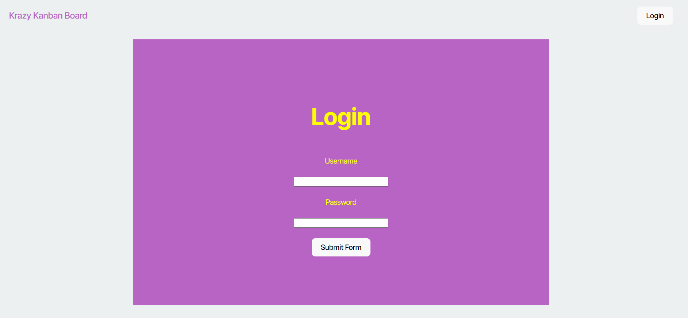
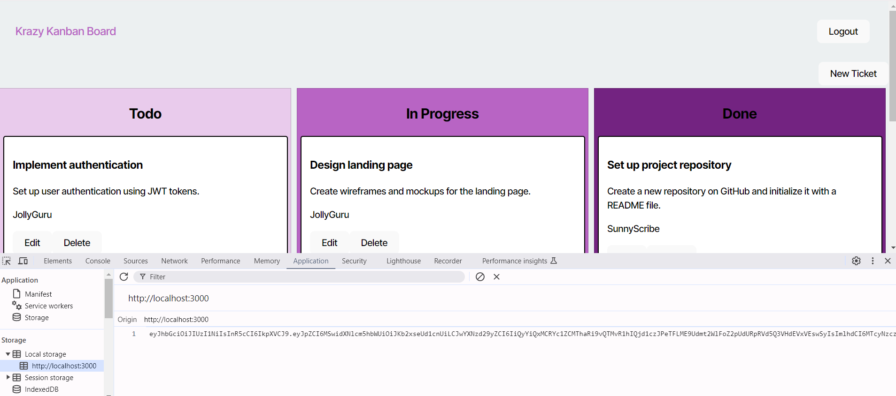

# Kanban Board with JWT Authentication

## Table of Contents

1. [Project Description](#project-description)
2. [Technology Stack](#technology-stack)
3. [Installation and Setup](#installation-and-setup)
4. [Features](#features)
5. [Usage](#usage)
6. [API Endpoints](#api-endpoints)
7. [Seed Data](#seed-data)
8. [Screenshots](#screenshots)
9. [Contributing](#contributing)
10. [License](#license)
11. [Deployed Application](#deployed-application)

## Project Description

This project is a full-stack Kanban board application that provides a secure login system using JSON Web Tokens (JWT). The board helps users to manage and organize tasks using different columns to represent various statuses like 'To Do', 'In Progress', and 'Done'. 

The application includes both a front-end and back-end, with authentication mechanisms to ensure only authorized users can access their tasks.

## Technology Stack

- **Front-End**: React, Bootstrap
- **Back-End**: Node.js, Express, TypeScript
- **Database**: PostgreSQL
- **Authentication**: JWT (JSON Web Tokens)
- **Hosting**: Render
- **Development Tools**: Insomnia for API testing, bcrypt for password hashing

## Installation and Setup

### Prerequisites

- Node.js (v16+)
- PostgreSQL
- npm

### Steps to Run the Application

1. **Clone the Repository**:
   ```sh
   git clone <repository-url>
   cd kanban-board
   ```

2. **Install Dependencies**:
   ```sh
   npm install
   cd server
   npm install
   cd ../client
   npm install
   ```

3. **Environment Variables**:
   Create a `.env` file in the `server` directory:
   ```env
   DATABASE_URL=<Your Database URL>
   JWT_SECRET_KEY=<Your JWT Secret Key>
   ```

4. **Database Setup**:
   Run the seed script to create tables and add sample data:
   ```sh
   npm run seed
   ```

5. **Run the Server**:
   ```sh
   cd ../server
   npm run dev
   ```

6. **Run the Client**:
   ```sh
   cd ../client
   npm start
   ```

## Features

- **User Authentication**: Secure login and registration system using JWT.
- **Task Management**: Users can create, update, delete, and organize tasks.
- **Persistent Sessions**: Token-based authentication for maintaining login sessions.
- **Responsive Design**: Fully responsive interface using Bootstrap.

## Usage

### Logging In
- Navigate to the login page and enter your credentials.
- On successful login, you'll be redirected to the main Kanban board.

### Managing Tasks
- Once logged in, add new tasks, drag tasks between columns, and delete them as needed.

### Logging Out
- To log out, click on the logout button in the navbar. This will remove the JWT token from local storage.

## API Endpoints

### Authentication
- `POST /auth/login`: Log in a user and return a JWT.
- `POST /auth/register`: Register a new user.

### Tasks
- `GET /api/tasks`: Get all tasks.
- `POST /api/tasks`: Add a new task.
- `PUT /api/tasks/:id`: Update a task.
- `DELETE /api/tasks/:id`: Delete a task.

## Seed Data

The application seeds the database with three users and multiple tasks by running the seed script (`npm run seed`). Use the following user credentials to log in:

- Username: `JollyGuru`, Password: `password`
- Username: `SunnyScribe`, Password: `password`
- Username: `RadiantComet`, Password: `password`

## Screenshots

### Login Page


### Kanban Board


## Contributing

Contributions are welcome! Please open an issue or submit a pull request for any changes.

## License

This project is licensed under the MIT License - see the [LICENSE](LICENSE) file for details.

## Deployed Application

You can access the live application at [Kanban Board](https://kanban-board-ahvd.onrender.com).